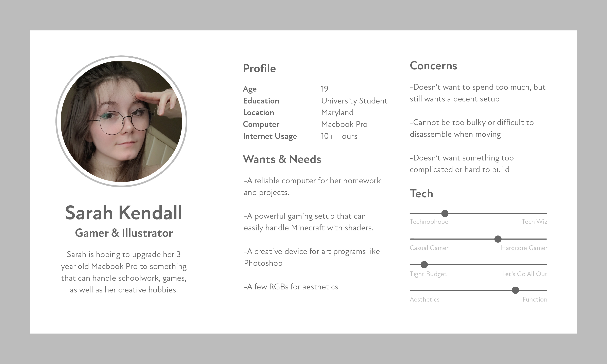
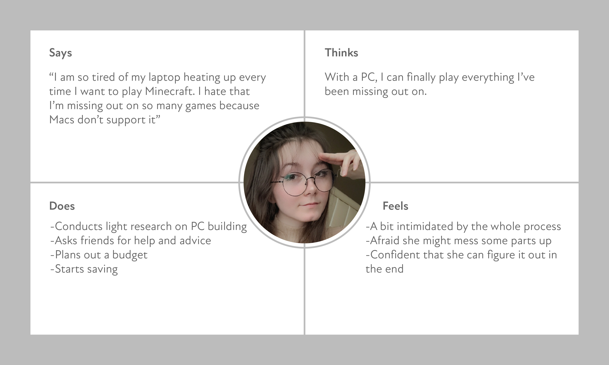
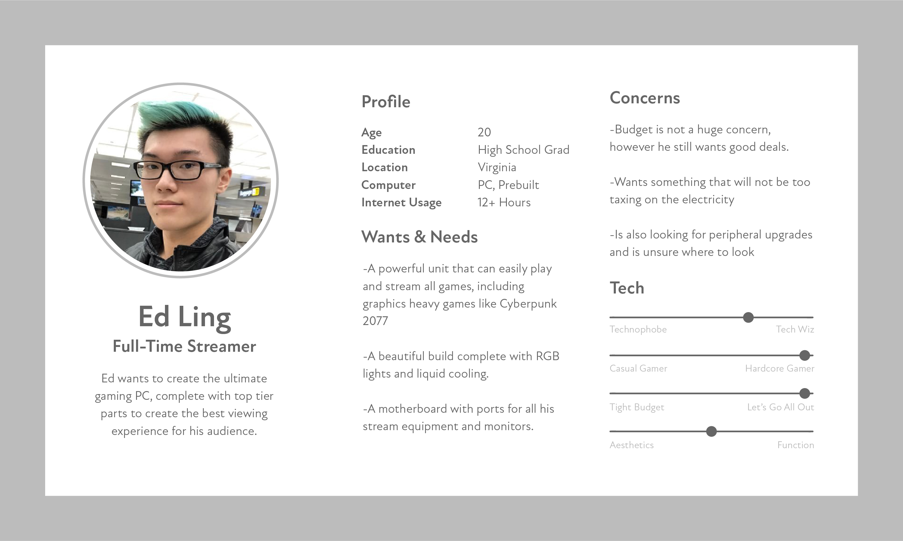

# Assignment04: Persona + Scenerio 
### DH110, Joie Cao

## Intro
My PC building app/website is aimed at helping new and inexperienced users learn and customize their own PC. For this assignment, I will be analyzing 2 friends who both share the need for a new PC, however their goals and desired features are completely different. 

## 2 Features to Proposal
First, I want to implement an easy tutorial system for new users to learn the technical vocabulary to PC building. The tutorial should be skippable, so that experienced users will not need to waste their time. The tutorial section should include short text descriptions of PC parts, and at the end it will direct the user to a library of videos and additional help. It should take around 10-14 minutes to complete, and once it is done the user can proceed to the rest of the app/site. Alternatively, short blurbs about PC components can appear as popups as the user is exploring the app/site. Again, experienced users will have the option to turn this feature off. 

Another feature I would like to try is product comparison tool. There are so many products on the PC market with various technical specificities. I want to make comparing products easier by allowing the user to put two products side by side. There should also be a price comparison tool or a price sorting tool. That way, people on a budget can easily find products that suit them. By extension, a tier list would be helful too. PC part such as graphics cards of CPUs can be categorized into tier lists based on needs. For example, an office tier CPU can be at the very bottom while a hardcore gaming tier CPU can be placed at the top. The specifications required for each of these tasks are completely different, and so is the computing power and price range. 

## Profile 1: Sarah

### Scenerio 
Sarah is a 19-year-old girl in her 2nd year of college. She studies psychology, but she has taken an interest in digital art and illustration as well as online gaming during quarantine. She has been using her Macbook since high school, and it has served her well. It gets her homework done and it’s portable for notetaking. However, she has become increasingly frustrated with her device. Oftentimes, when she wants to run Photoshop or Illustrator her out-of-date device starts to chug and cannot handle her workload. It makes loud sounds and lags. Even worse, when she wants to play video games, it can barely handle anything. Her games often crash and her laptop heats up to unsafe temperatures. She cannot handle this setup anymore, and so she’s started to save up for a custom PC build. She’s hoping that with a new PC, she’ll finally be able to run her creative programs and games smoothly. She cannot wait to play the games that are exclusive to windows, like Nier Automata and Valorant. Additionally, she’s hoping to upgrade her monitor to something larger and brighter, so that she can have a better display for her art.

Her main concern is her budget. Since she is a college student, she’s very limited in what she can spend. She has no room in her budget to buy fancy RGB lights or aesthetic upgrades like liquid cooling, she simply wants a custom build that works. However, the one aesthetic requirement she does have is a white case to match her white table. Another concern she has is the difficulty of the build. She is a complete beginner to PC building, or PCs in general. She’s hoping from one OS to another and everything seems overwhelming.

In this scenario, Sarah will hop on my unnamed PC building software. The first thing she sees will be a welcome page, followed by a short experience survey. She answers that she is a complete beginner, and the rest of the app/site launches. The home page will feature a blank PC with all the parts labeled. She will be able to click on any of the parts, and it will lead to a new page with more information about that part. For example, if she clicks CPU, a new page will open and a brief explanation of CPUs will appear at the top. Below, she will find various CPUs categorized into several tiers, including Casual, Creative, Gamer, Hardcore Gamer, etc. She can then find the CPU that best suits her needs. Alternatively, she can take another short survey and the system can match her with a suitable CPU. She will then repeat these steps for the rest of the PC. At the bottom of the home page, there will be a library of video tutorials for PC assembly as well as peripherals (such as mouse, keyboard, headphones, microphone) and desk and chair recommendations. These features will hopefully make learning a more gradual process. 

## Profile 2: Ed

### Scenerio 
Ed is a 20-year-old full-time streamer on Twitch. He finished high school just two years ago, when his channel was first taking off. He decided to take the risk and fully commit to his streaming career. Luckily, this risk paid off and now he is very successful with a very active community around him. How, he’s looking up finally upgrade his PC to something professional quality and long-lasting. His needs are complicated. He wants to connect multiple monitors and his streaming gear. He also needs a fancy graphics card and CPU that can handle heavy gaming and stream it at the same time. Additionally, he wants a build he can show off. His PC is a mark of his success as well as a major business tool. It’s worth investing into, as viewers will see the improvement in the quality of his streams. 

Ed, just like Sarah, is not too experienced in the world of PC building. Although he already owns a PC, it was prebuilt and he had no say in every specification inside it. He wants something crazy and huge, but he also needs it to be within his technical skill. He is a bit of a techy, but by no means experienced. He knows the names of most parts and the technical jargon associated with the products. He can tell Intel from Ryzen, and he absolutely needs an RTX 3070. 

In this scenario, Ed can test the product comparison feature. He will launch the app and be greeted by a welcome screen and experience survey. Since he is intermediate in PC knowledge, the interface is much simpler. Of course, if he needs a refresher, he can easily access this information by hovering over each PC part to see what it does. He wants to shop for graphics cards first, so he clicks on that page. He sees multiple tiers of cards. He picks the tier that is appropriate for him, and sees that there are a few recommendations. He selects 2 of these recommendations and uses the product compare feature to learn more about them. Once he decides on the one that is perfect for him, he adds it to his PC part list and moves onto the next product. 

